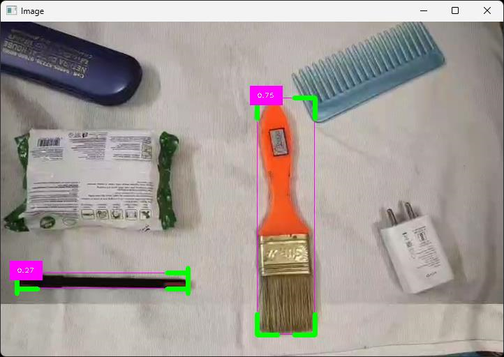

# Object_detection_Webcam
Object Detection Webcam: A cutting-edge application that leverages the power of object detection algorithms to identify and classify objects in real-time through a webcam feed. This application stands out for its ability to detect objects within images only, ensuring a focused and efficient object detection experience. It’s an excellent demonstration of applying AI in real-world scenarios, offering potential for numerous applications such as surveillance, robotics, and interactive technology. Dive into the world of AI with this interactive, real-time object detection system.

